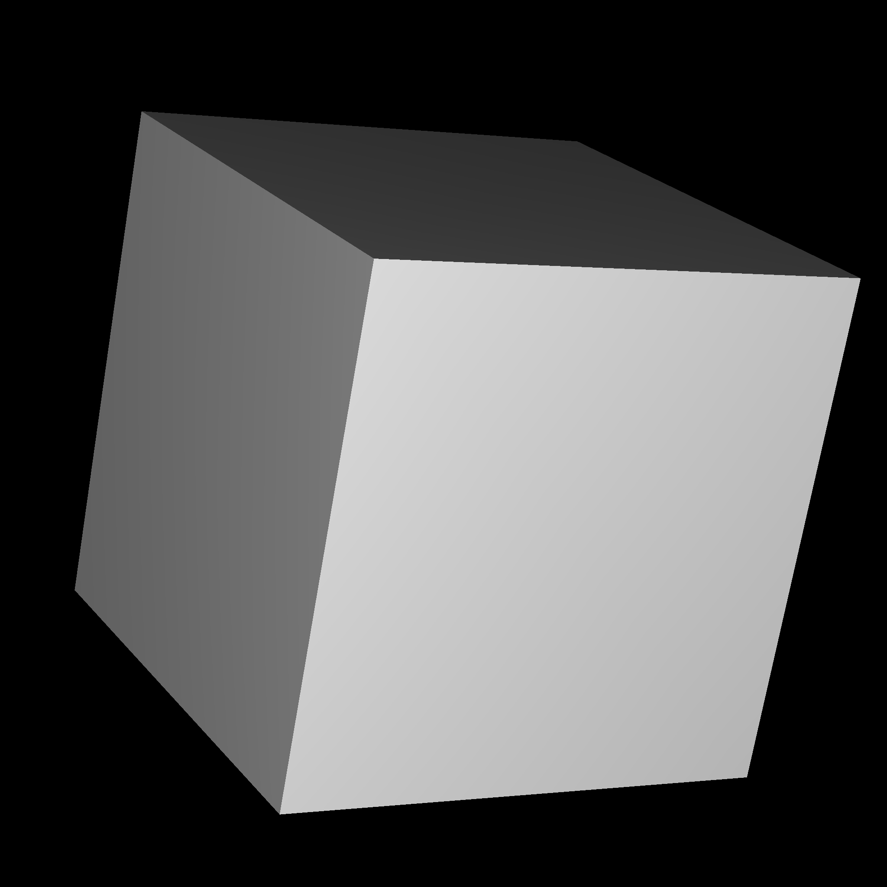

# Termesh
An interactive 3D renderer right in your terminal.

[demo](https://github.com/user-attachments/assets/abc066dc-a92e-4925-a706-75ba97cd51ec)

[demo2](https://github.com/user-attachments/assets/8704274a-7f4b-43cc-9073-99cebe2e0f83)



## Controls
| Key | Effect |
| --- | ------ |
| `W` | move forwards |
| `A` | move left |
| `S` | move backwards |
| `D` | move right |
| `<space>` | move up |
| `Z` | move down |
| `H` | turn left |
| `J` | turn down |
| `K` | turn up |
| `L` | turn left |

## Build Instructions
```bash
git clone https://github.com/dmpribak/termesh.git
cd termesh
git submodule update --init --recursive
apt install libnotcurses-dev # install dependencies
mkdir build
cd build
cmake -DCMAKE_BUILD_TYPE=Release ..
cmake --build .
./termesh your_mesh.ply # runs the built binary
```
